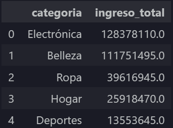
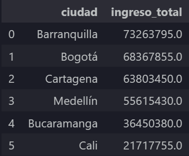

# 📊 Proyecto de Análisis de Ventas con SQL y Python

## 📌 Descripción

Este proyecto simula el trabajo de un Analista de Datos Junior dentro de una empresa comercial. El objetivo es realizar una auditoría de calidad de datos, ejecutar un proceso de limpieza (ETL), analizar la información mediante SQL y Python, generar visualizaciones y presentar conclusiones orientadas al negocio.

Todo el proyecto fue desarrollado siguiendo una metodología similar a la utilizada en entornos empresariales, donde los datos iniciales contienen errores de calidad que deben resolverse antes de realizar cualquier análisis.

---

# 🎯 Objetivos

- Detectar problemas de calidad en los datos.
- Aplicar un proceso de limpieza y transformación (ETL).
- Analizar información mediante consultas SQL.
- Construir visualizaciones para facilitar la toma de decisiones.
- Elaborar recomendaciones basadas en evidencia.

---

# 🛠 Tecnologías utilizadas

- Python
- Pandas
- SQLite
- SQL
- Matplotlib
- Jupyter Notebook
- VS Code

---

# 📂 Estructura del proyecto

```
Proyecto-Ventas/

│
├── data/
│   ├── raw/
│   └── processed/
│
├── docs/
│   ├── imgs/
│   └── md/
│
├── notebooks/
│
├── reportes/
│
└── README.md
```

---

# 🔄 Flujo de trabajo

El proyecto se desarrolló siguiendo las siguientes etapas:

```
Auditoría de datos

↓

Limpieza de datos (ETL)

↓

Análisis mediante SQL

↓

Visualización

↓

Conclusiones de negocio
```

---

# 📋 Fases del proyecto

## 🔎 Fase 1 — Auditoría de calidad

Durante esta etapa se identificaron problemas como:

- Cantidades negativas.
- Registros huérfanos.
- Valores nulos.
- Registros duplicados.
- Inconsistencias en variables categóricas.

---

## 🧹 Fase 2 — Limpieza de datos

Se aplicaron procesos de limpieza para mejorar la calidad del conjunto de datos:

- Eliminación de registros inválidos.
- Eliminación de duplicados.
- Corrección de integridad referencial.
- Normalización de categorías.
- Tratamiento de valores nulos.

---

## 📈 Fase 3 — Análisis

Mediante consultas SQL y Pandas se respondió a preguntas de negocio como:

- ¿Qué categoría genera mayores ingresos?
- ¿Qué ciudad produce mayores ventas?
- ¿Cuál es el ticket promedio por segmento?
- ¿Qué productos superan el ingreso promedio?

---

## 📊 Fase 4 — Visualización

Se construyeron gráficos para comunicar los resultados del análisis:

- Barras por categoría.
- Barras por ciudad.
- Ticket promedio por segmento.

---

## 💼 Fase 5 — Conclusiones

Finalmente se generaron recomendaciones orientadas al negocio con base en los hallazgos obtenidos durante el análisis.

---

# 📌 Principales aprendizajes

Este proyecto permitió fortalecer habilidades relacionadas con:

- SQL (JOINs y subconsultas)
- Limpieza de datos
- ETL con Pandas
- Integridad referencial
- Visualización de datos
- Documentación técnica
- Análisis exploratorio
- Pensamiento analítico orientado al negocio

---

# 📷 Vista previa

## Ingreso por categoría



---

## Ciudad con mayores ingresos



---

## Ticket promedio


---

# 👨‍💻 Autor

**Daniel Eduardo Cerón Castillo**

Tecnólogo en Desarrollo de Software.

Interesado en:

- Análisis de Datos
- Business Intelligence
- Visualización de Datos
- Machine Learning