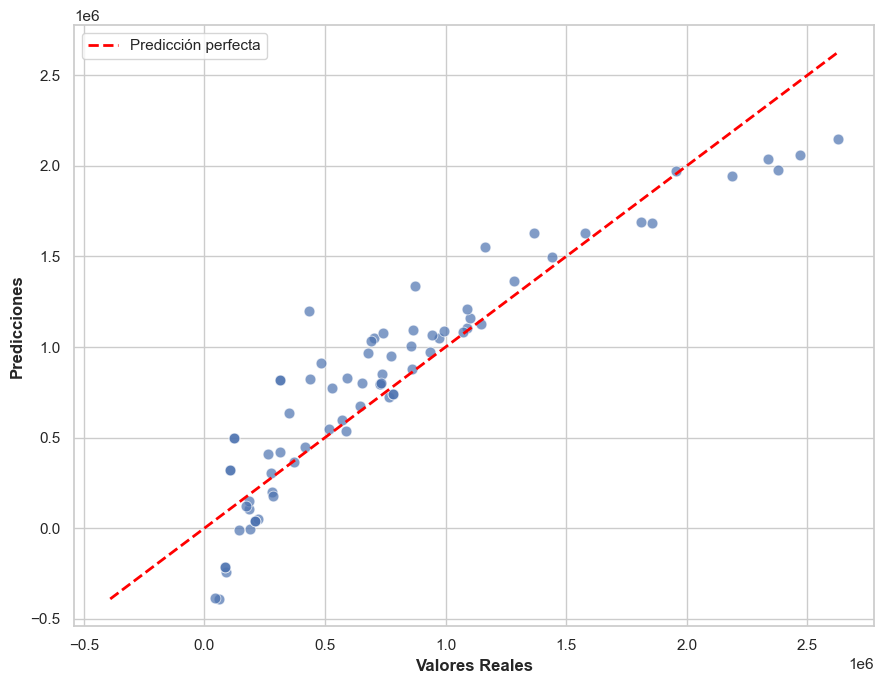
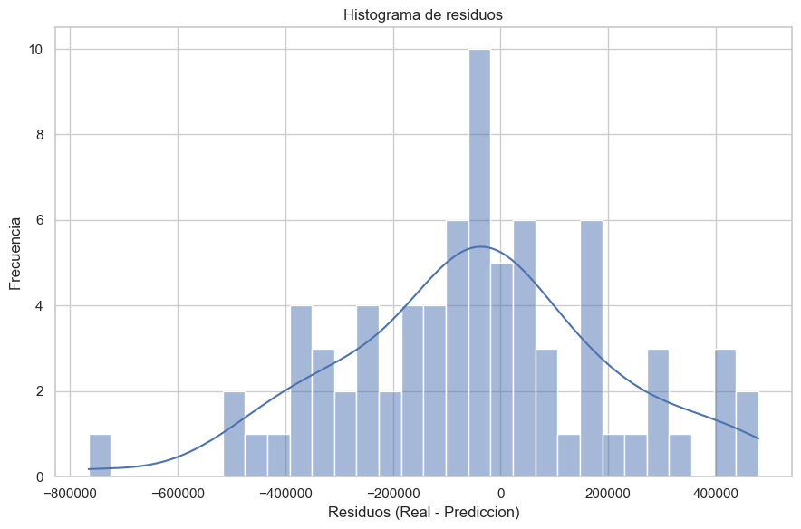
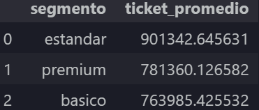

# 📊 Proyecto de Análisis de Ventas con SQL y Python

## 📌 Descripción

Este proyecto simula el trabajo de un Analista de Datos Junior dentro de una empresa comercial. El objetivo es realizar una auditoría de calidad de datos, ejecutar un proceso de limpieza (ETL), analizar la información mediante SQL y Python, generar visualizaciones y presentar conclusiones orientadas al negocio.

Todo el proyecto fue desarrollado siguiendo una metodología similar a la utilizada en entornos empresariales, donde los datos iniciales contienen errores de calidad que deben resolverse antes de realizar cualquier análisis.

---

# 🎯 Objetivos

- Detectar problemas de calidad en los datos.
- Aplicar un proceso de limpieza y transformación (ETL).
- Analizar información mediante consultas SQL.
- Construir visualizaciones para facilitar la toma de decisiones.
- Elaborar recomendaciones basadas en evidencia.

---

# 🛠 Tecnologías utilizadas

- Python
- Pandas
- SQLite
- SQL
- Matplotlib
- Scikit-Learn
- Seaborn
- Jupyter Notebook
- VS Code

---

# 📂 Estructura del proyecto

```
Proyecto-Ventas/

│
├── data/
│   ├── raw/
│   └── processed/
│
├── docs/
│   ├── imgs/
│   └── md/
│
├── notebooks/
│
├── reportes/
│
└── README.md
```

---

# 🔄 Flujo de trabajo

El proyecto se desarrolló siguiendo las siguientes etapas:

```
Auditoría de datos

↓

Limpieza de datos (ETL)

↓

Análisis mediante SQL

↓

Visualización

↓

Conclusiones de negocio
```

---

# 📋 Fases del proyecto

## 🔎 Fase 1 — Auditoría de calidad

Durante esta etapa se identificaron problemas como:

- Cantidades negativas.
- Registros huérfanos.
- Valores nulos.
- Registros duplicados.
- Inconsistencias en variables categóricas.

---

## 🧹 Fase 2 — Limpieza de datos

Se aplicaron procesos de limpieza para mejorar la calidad del conjunto de datos:

- Eliminación de registros inválidos.
- Eliminación de duplicados.
- Corrección de integridad referencial.
- Normalización de categorías.
- Tratamiento de valores nulos.

---

## 📈 Fase 3 — Análisis

Mediante consultas SQL y Pandas se respondió a preguntas de negocio como:

- ¿Qué categoría genera mayores ingresos?
- ¿Qué ciudad produce mayores ventas?
- ¿Cuál es el ticket promedio por segmento?
- ¿Qué productos superan el ingreso promedio?

---

## 📊 Fase 4 — Visualización

Se construyeron gráficos para comunicar los resultados del análisis:

- Barras por categoría.
- Barras por ciudad.
- Ticket promedio por segmento.

---

## 💼 Fase 5 — Conclusiones de negocio

### Hallazgos principales

- **Electrónica** es la categoría con mayor ingreso total (128.3M, 40.2% del total),
  seguida de cerca por **Belleza** (111.7M, 35.0%). Juntas concentran el 75% del 
  ingreso total del período analizado. **Deportes** es la categoría con menor ingreso 
  (13.5M, 4.2%) — no se recomienda descontinuarla basándose únicamente en este dato, 
  ya que el análisis no contempla margen de ganancia, frecuencia de compra ni 
  estacionalidad.

- **Barranquilla** lidera en ingresos con 73.2M (22.9%), pero las primeras cuatro 
  ciudades están agrupadas entre 20% y 23% — no hay una ciudad dominante clara. 
  Antes de priorizar una campaña de marketing en Barranquilla se recomienda cruzar 
  este dato con el número de clientes activos por ciudad para determinar si el 
  liderazgo responde a mayor base de clientes o a un ticket promedio más alto.

- El segmento **Estándar** registró el ticket promedio más alto (901.342 COP), 
  por encima del segmento **Premium** (781.360 COP). Este hallazgo es contraintuitivo 
  y debe interpretarse con cautela dado el tamaño del dataset — se recomienda 
  validarlo con datos reales antes de tomar decisiones sobre la estrategia de 
  segmentación.

---

## 🤖 Fase 6 — Modelo de Regresión Lineal

Se implementó un modelo de regresión lineal con Scikit-Learn para predecir 
el ingreso por venta a partir de variables conocidas al momento de la transacción.

**Variables predictoras:** cantidad, descuento_pct, precio_unitario, categoria (One-Hot Encoding)  
**Variable objetivo:** ingreso = cantidad × precio_unitario × (1 − descuento_pct / 100)

### Resultados del modelo

- **R²: 0.8386** — el modelo explica el 83.9% de la variación en el ingreso por venta
- **MAE: 192.621 COP** — error promedio por predicción (22.87% del ticket promedio)
- **Variable de mayor impacto:** cantidad (coeficiente: 202.359,55)
- **Categoría con menor aporte predicho:** Ropa (coeficiente: −47.827)

### Conclusión del modelo

El modelo supera el umbral mínimo de R² = 0.80 considerado aceptable para producción. 
El modelo no contempla margen de ganancia, estacionalidad ni 
frecuencia de compra.

### Vista previa




---

# 📌 Principales aprendizajes

Este proyecto permitió fortalecer habilidades relacionadas con:

- SQL (JOINs y subconsultas)
- Limpieza de datos
- ETL con Pandas
- Integridad referencial
- Visualización de datos
- Documentación técnica
- Análisis exploratorio
- Pensamiento analítico orientado al negocio
- Regresión lineal con Scikit-Learn
- Evaluación de modelos (R², MAE, RMSE)
- One-Hot Encoding
- Train/Test Split
- Interpretación de coeficientes

---

# 📷 Vista previa

## Ingreso por categoría


---

## Ciudad con mayores ingresos


---

## Ticket promedio



---

# 👨‍💻 Autor

**Daniel Eduardo Cerón Castillo**

Tecnólogo en Desarrollo de Software.

Interesado en:

- Análisis de Datos
- Business Intelligence
- Visualización de Datos
- Machine Learning